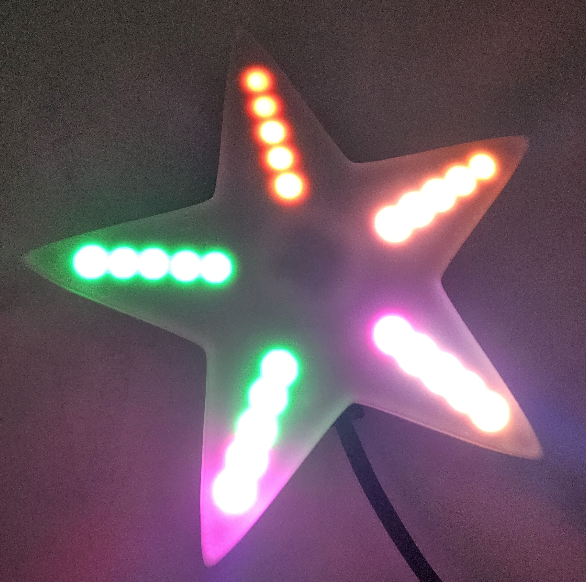
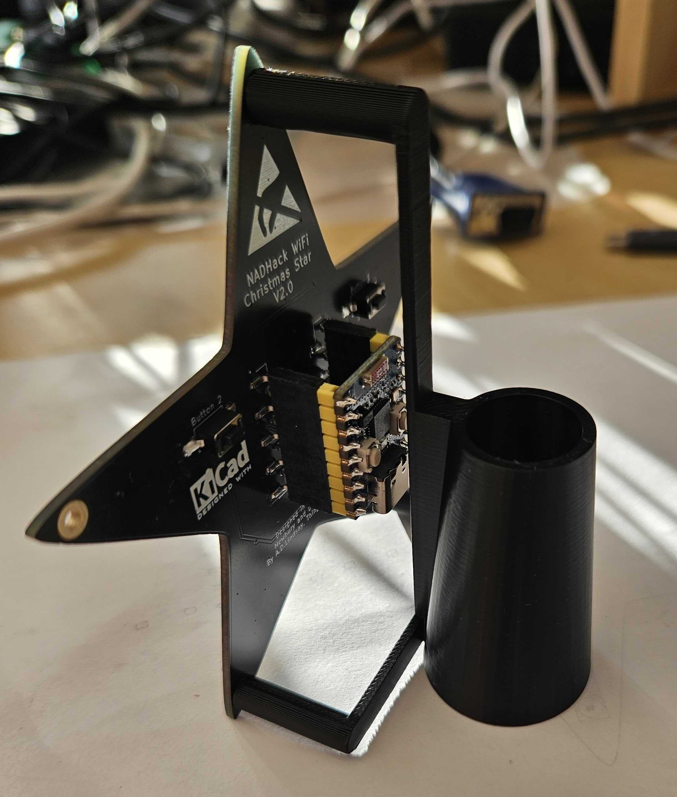
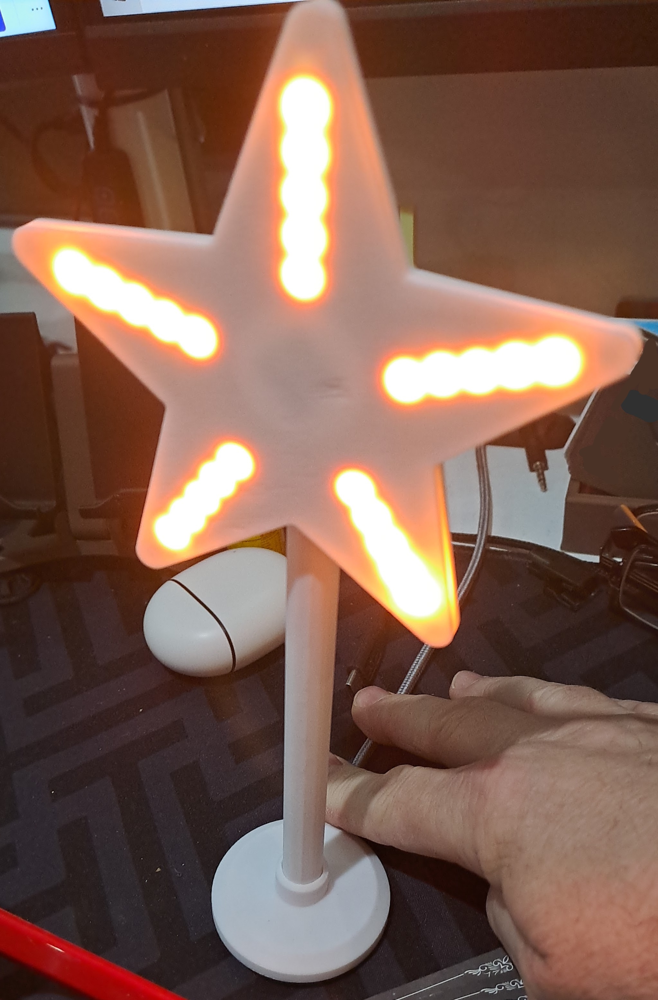

Addon files for the NADHack Xmas Star V2.0.

These can be used as a starting point for your own projects. Source and usable files are available.

The main file is *staroutline.svg* which was used to create the star PCB outline. This can be used to get the correct shape.

Other files:

* *StarCover* Diffuser cover for star created with [OpenSCAD](https://openscad.org/). Source file and *.stl* file suitable for 3D printing.
* *StarBracket* Bracket for star, example is a tree topper created with [OpenSCAD](https://openscad.org/). Source file and *.stl* file suitable for 3D printing.
* *Seasonal_Star* for those that want a desk stand, Fusion360 and *.stl* file suitable for 3D printing. Designed and kindly shared by Craig Hogan.

Star cover/diffuser

Tree Topper bracket

Star Stick - Designed and kindly shared by Craig Hogan

