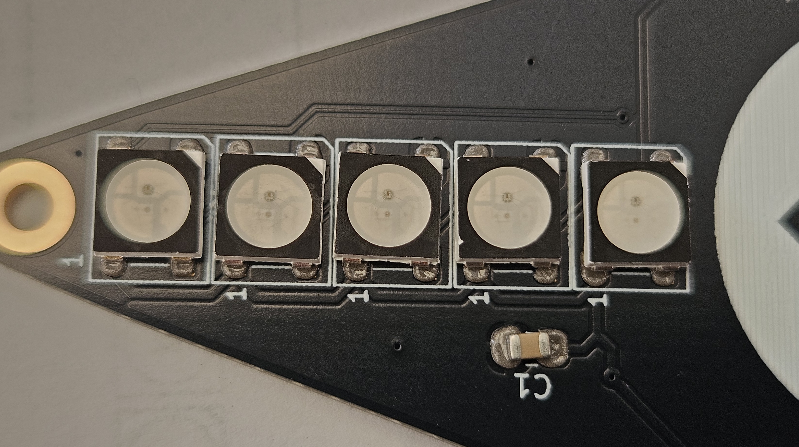
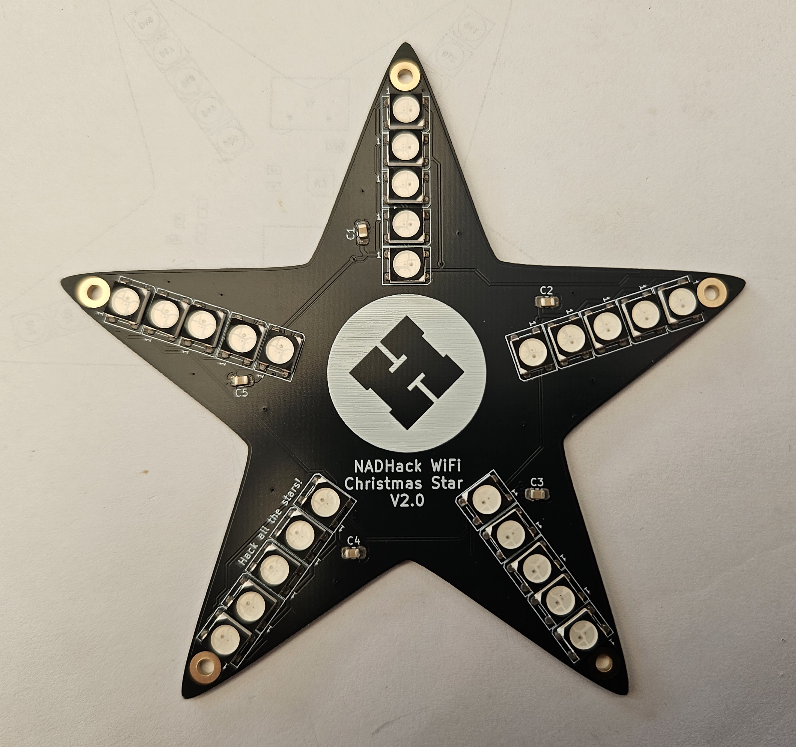

# Front component Placement

The components should be identified, 5 capacitors and 25 addressable LEDs.

Working on one point of the star at a time, arrange 5 LEDs in the correct order, noting the position of the triangular cutout. This indicates pin 3, not the usual pin 1. Each point is placed identically.

Using tweezers, place one of the capacitors onto the pads, use a coctail stick to hold the component down while removing the tweezers just incase it sticks and lifts away.
Place the first LED on the pads closest to the centre of the star, taking care not to have any clothing, jewellery or body parts touch the rest of the PCB. 

Line up 5 LEDs, orientated correctly and place one at a time on each star point.

The board should look like this

