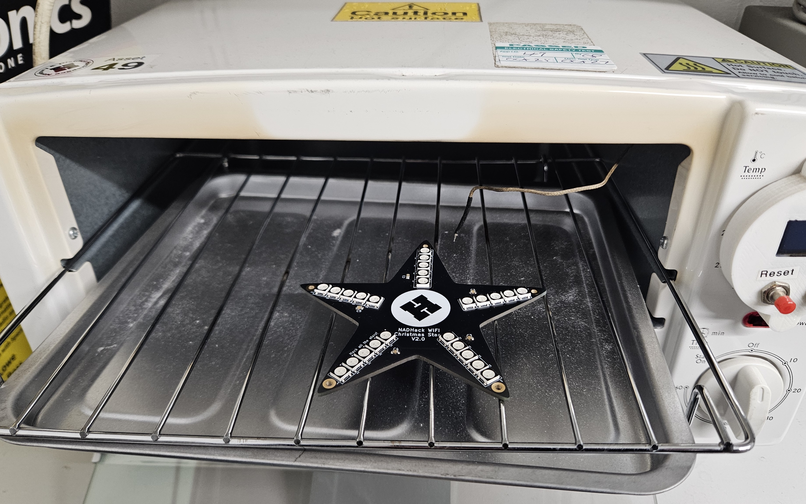
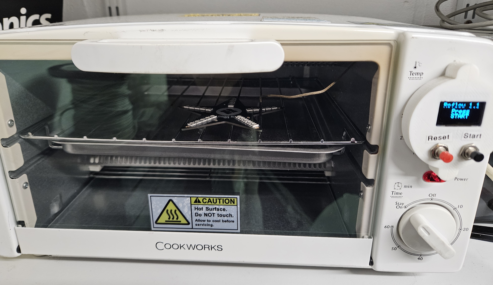
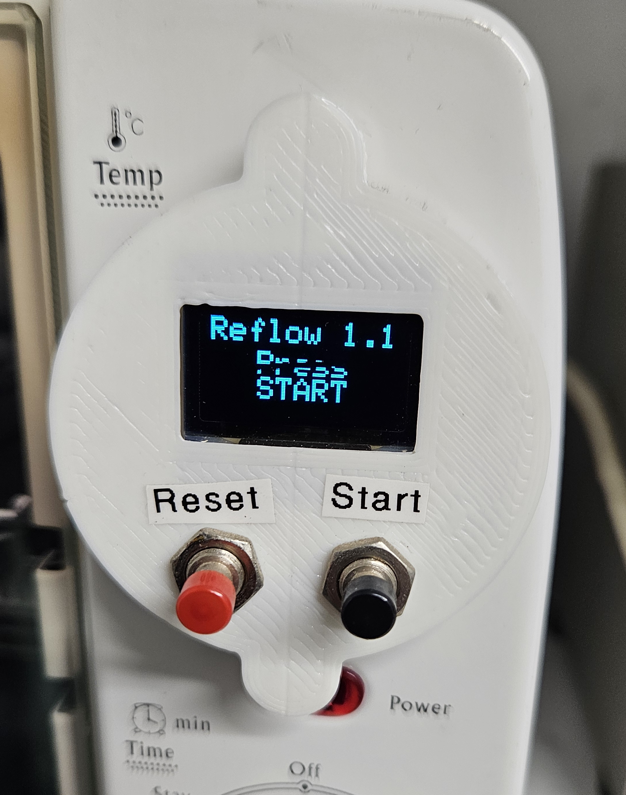
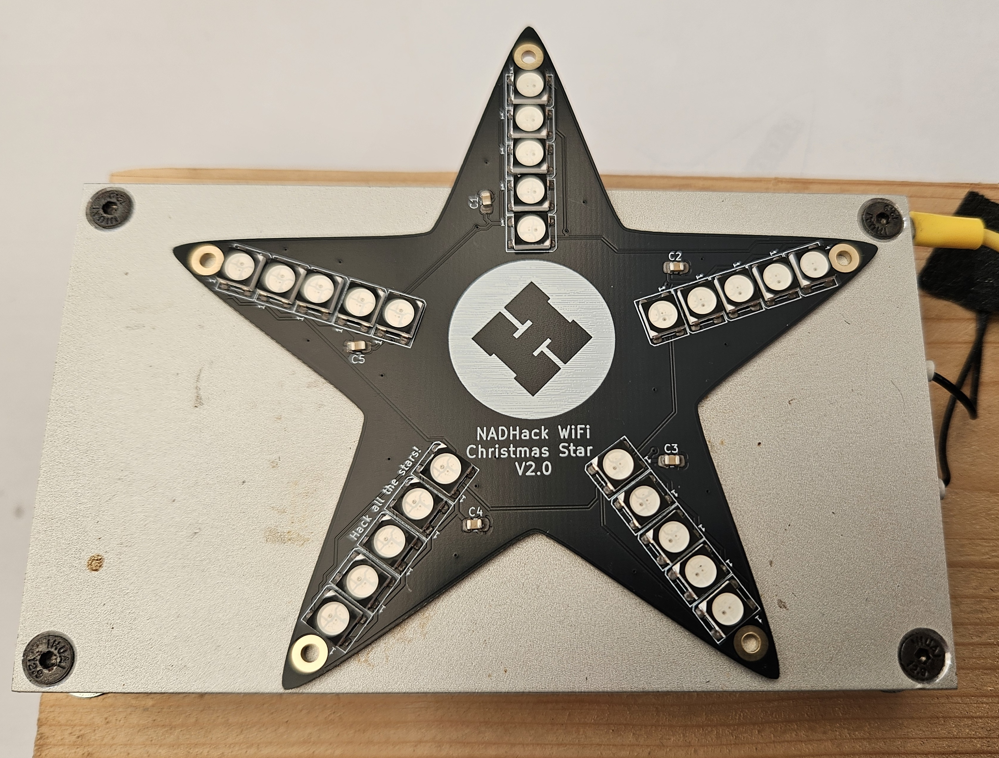

# Front Soldering

The PCB can now be soldered using either a reflow oven or a hot plate. The reflow oven used here is basically a modified toaster oven with a controller that is programmed to heat up using a generic timing profile.

Carefully place on the shelf without touching the components.

Close the door.

Switch the oven on and Start the program. It is pre-programmed to heat up at a set rate so that the components heat up evenly.

When the cycle has finished open the door and allow the PCB to cool down before touching it. At this point the solder is still molten and any movement can dislodge the components.

An alternative to the reflow oven is a hotplate, however these have no control over temperature and timings. The hotplate here is too small to fully solder the star and it needs careful handling to ensure it can be fully soldered.

