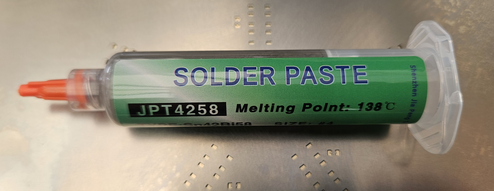
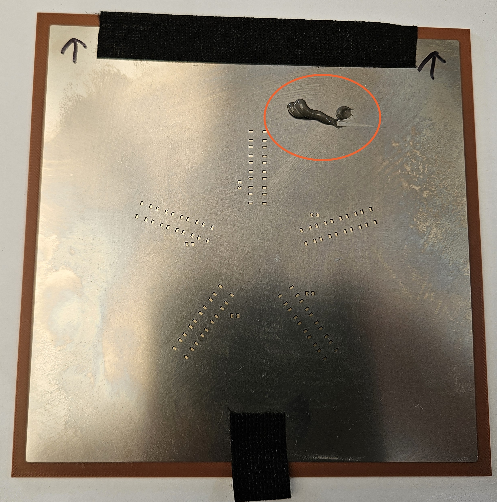
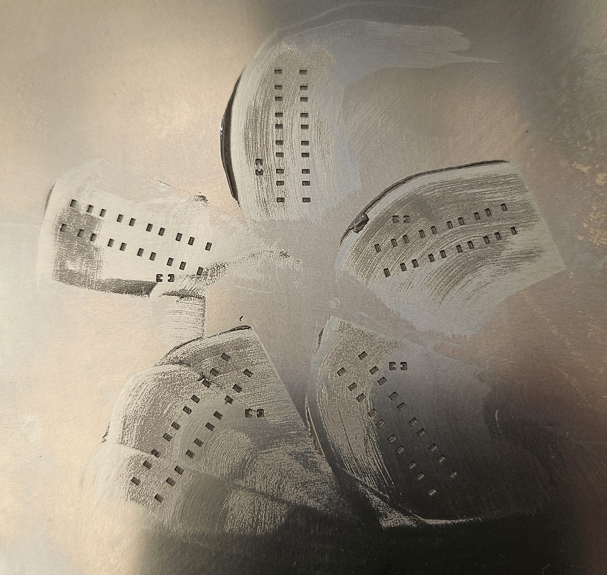
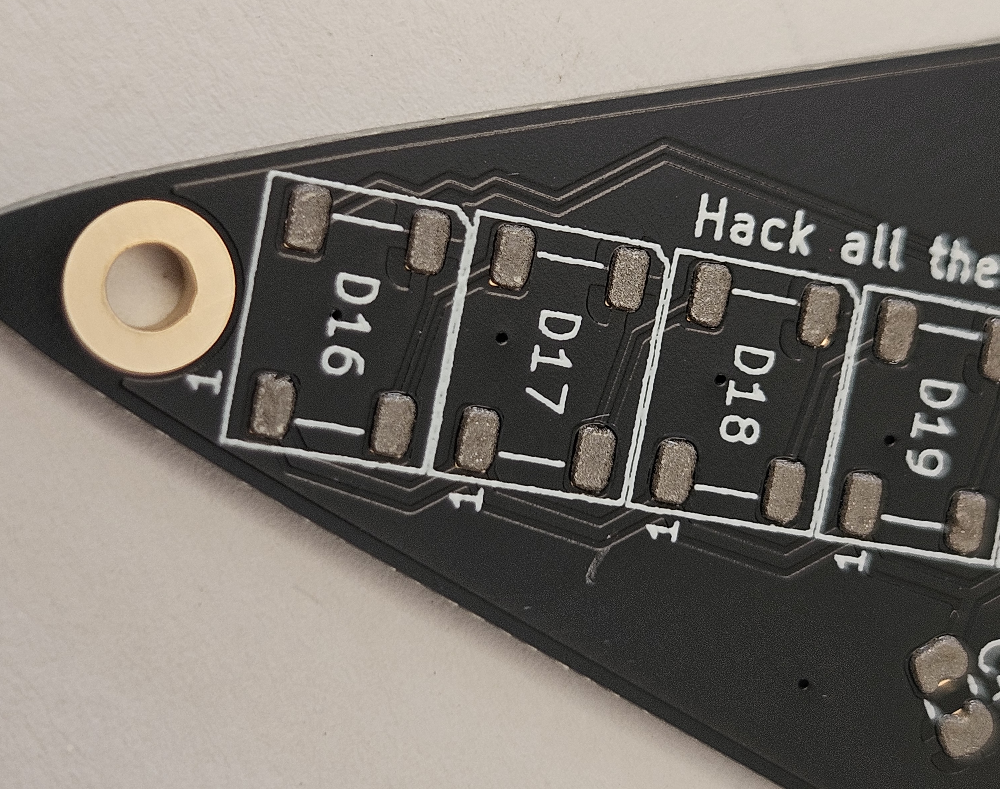

# Front Solderpaste

Unlike traditional electronics assembly with through hole components, we need to use a solder paste which is made up of tiny balls of solder in a liquid flux to create a spreadable paste.

A stainless steel stencil is used to ensure the solderpaste is applied to the component pads. These are normally ordered at the same time as the PCBs. The stencil thickness will determine how much paste is placed onto the pads.

The PCB is placed into the front holder, the stencil is placed over the top and a scraper is used to spread the paste across the holes using a single smooth motion.

Apply stencil, ensure the pads are visible through the stencil holes. Squeeze out a blob of solderpaste as shown in the circled part.

Apply the paste. It can be easier to apply to each star point in turn.

Carefuly lift up the stencil. The board should look like this.

Close up of the pads.

The stencil can be cleaned using IPA and a paper towel ready for the next person to use. Remember to clean both sides.
