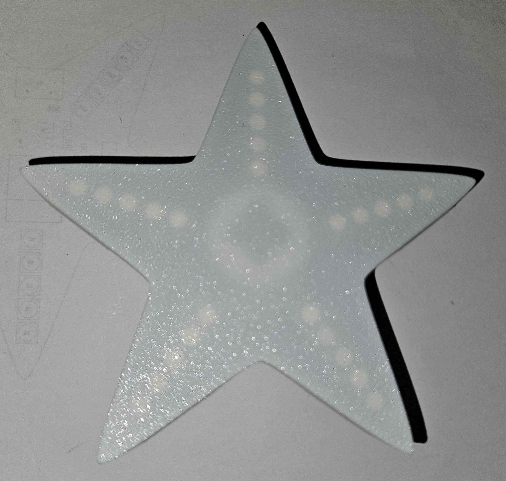
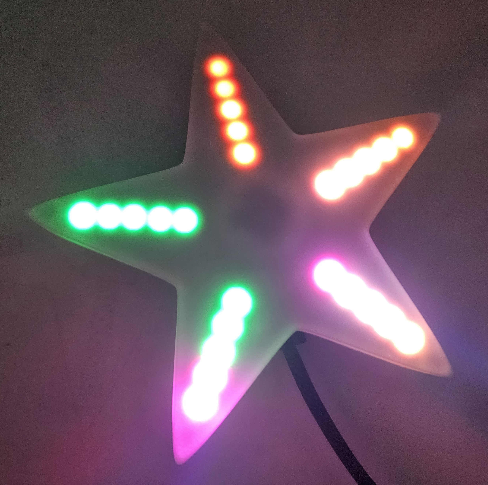

# Addons

The Xmas Star 2.0 files are all available on the [Github repository](https://github.com/nadhack/Xmas_Star2.0).

The idea is that you have the files you need to create your own addons and new versions. The original star shape outline is available in the file *staroutline.svg*

# 3D printed cover

A simple star shaped diffusing cover created using [OpenSCAD](https://openscad.org/), the script uses the *staroutline.svg* file.

