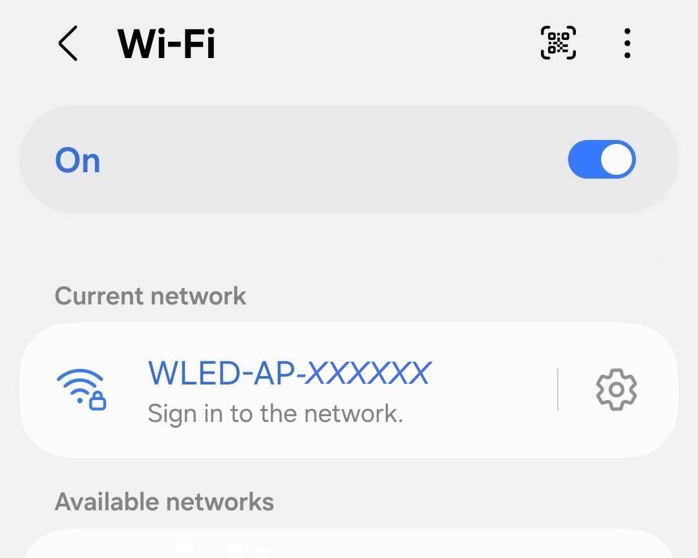

# Configuring WLED

On the ESD bag containing the ESP32 module there is a label with the Access Point (AP) configured on this ESP32 module. Look for the *WLED-AP-xxxxxx* access point using your phone or laptop WiFi and connect to it. The screenshots below are from using a phone to configure the star.

Click on the correct *WLED-AP-xxxxxx* to connect to it then click on *Sign in to the network* which takes you to the ESP32 WLED configuration. If a password is required then enter *wled1234*.

Click on the *Config* button then the *WiFi Setup* button.

Enter your WiFi network settings.

The app will disconnnect from the star and reconnect to your previous WiFi. 
