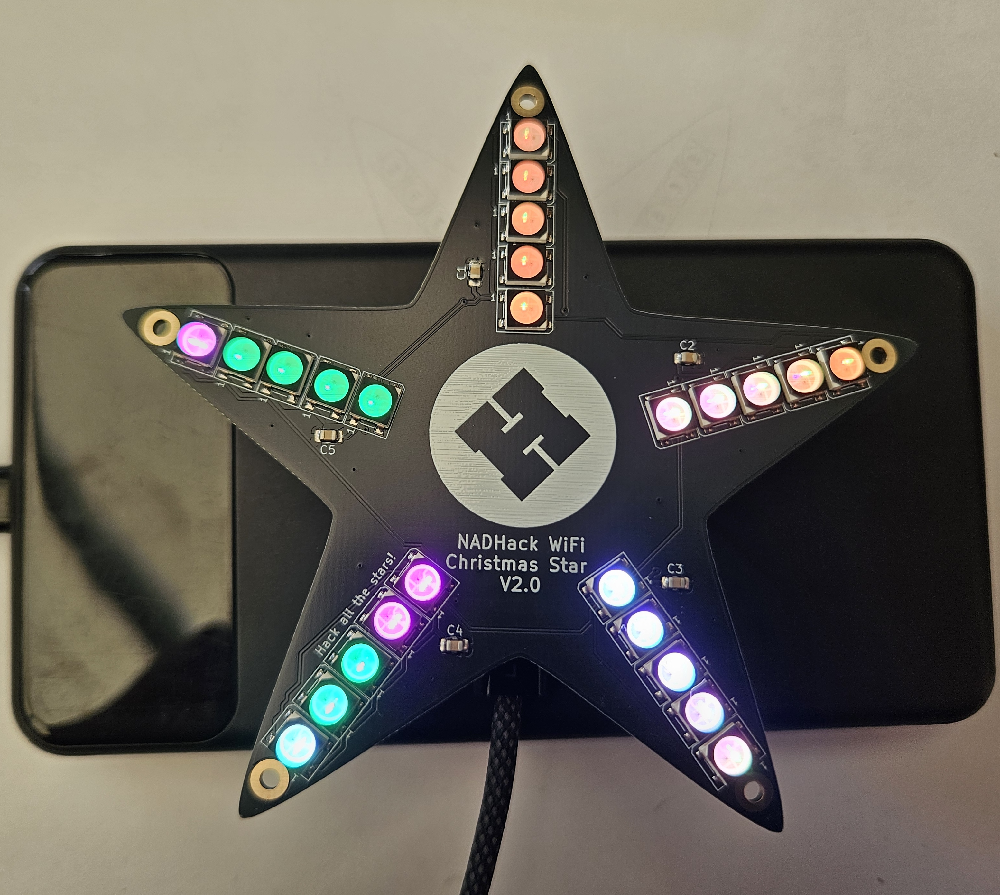

# Powering Star

The Xmas Star 2.0 includes a USB-C connector for programming and power. This can be connected to a laptop, USB mains adaptor or a powerbank.

If you see all the LEDs light up and produce a pattern then congratulations, you have completed the hard part of the workshop.

If your star fails to power up and show a pattern, don't worry, there may be a faulty solder joint. One of the helpers will be able to help and fix it for you.

