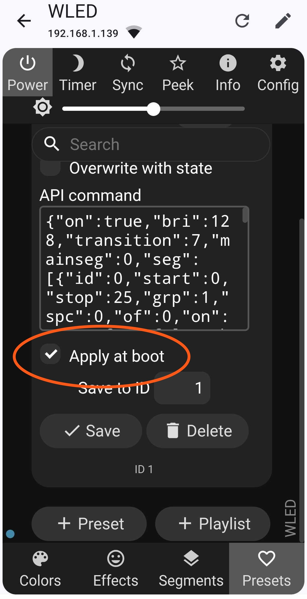

# Using WLED

Run the *WLED App* and your star should show up. The slider controls the brightnes and the toggle powers the LEDs on and off. Click on the name to enter the configuration screens.

From the *Config* button, select *LED Preferences* to verify the correct LED setup. It should be set to *WS281x*, Length of *25* and the GPIO set to *2* as shown here.

Selecting the *Effects* button at the bottom brings up a list of effects that can be selected. Some work well with the star, others are more suited to other LED configurations such as LED matrix. 

Selecting the *Colors* (US Spelling!!) button takes to toy a screen where different colour sets can be selected. 

Once you are happy with an effect and want to keep it, select the *Presets* button at the bottom. If you select the *Apply at boot* then the effect will be shown when your star is powered on without having to use the app to set the colours and effect.

