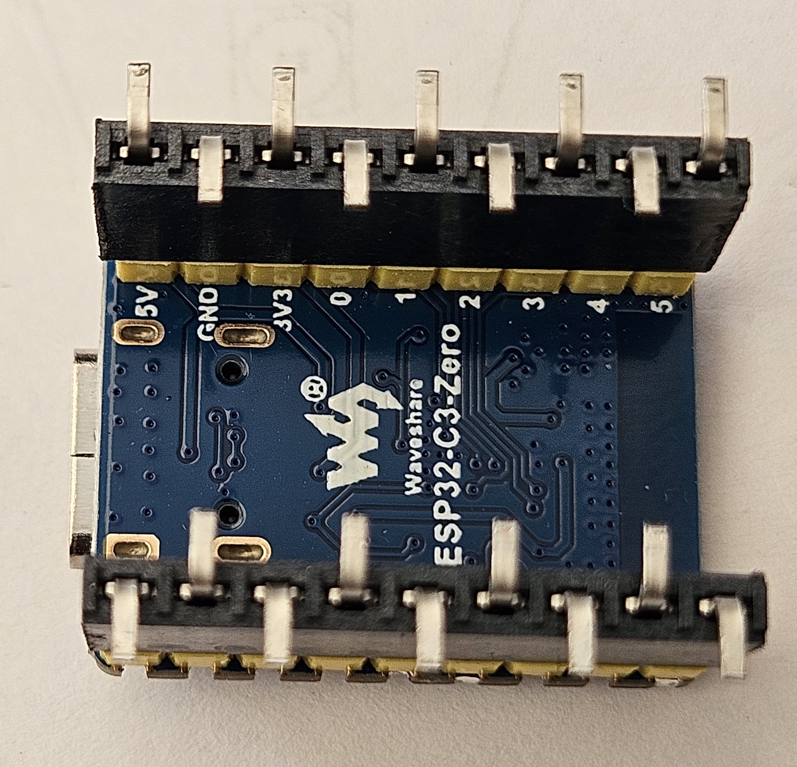
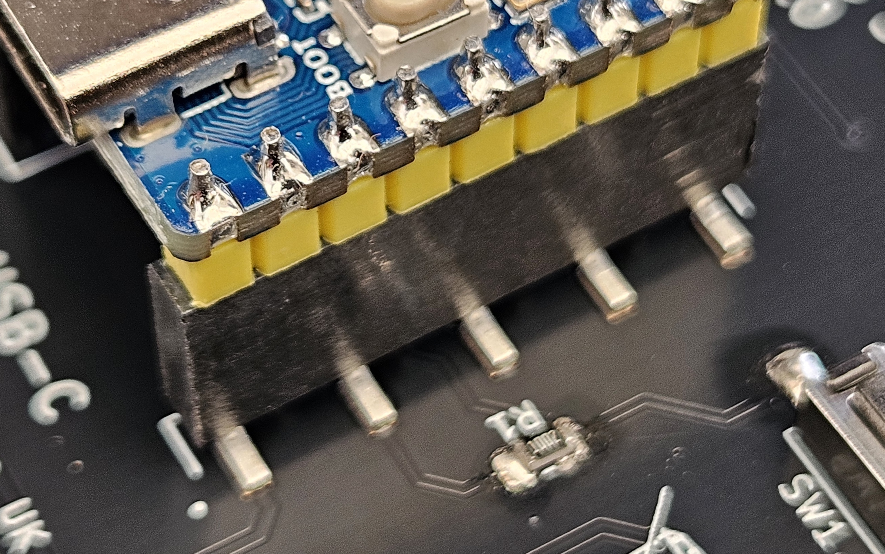

# Rear Soldering

The components on the rear side are to be soldered by hand using a regular soldering iron to melt the solderpaste.

For the first joint it is advisable to use a coctail stick to hold the component in place as there is a risk that when the soldering iron is removed it can take the component with it.

Solder the resistors and pushbuttons.

Push the 2 headers onto the ESP32 module, ensure the 5 legs are outside and 4 legs inside. This is to match the PCB pads.

Both headers on the ESP32 module.

Place the assembly onto the pads, they should all line up. Press down on the ESP32 module to hold it in place. Place the soldering iron tip onto the metal contact and wait for it to heat up and melt the solder paste, repeat for all the pins on one side them turn the star around and repat for the second side.

Carefully remove the ESP32 module, the headers will, if soldered correctly, remain on the PCB. Carefully solder the inside 8 pins, 4 on each side.

