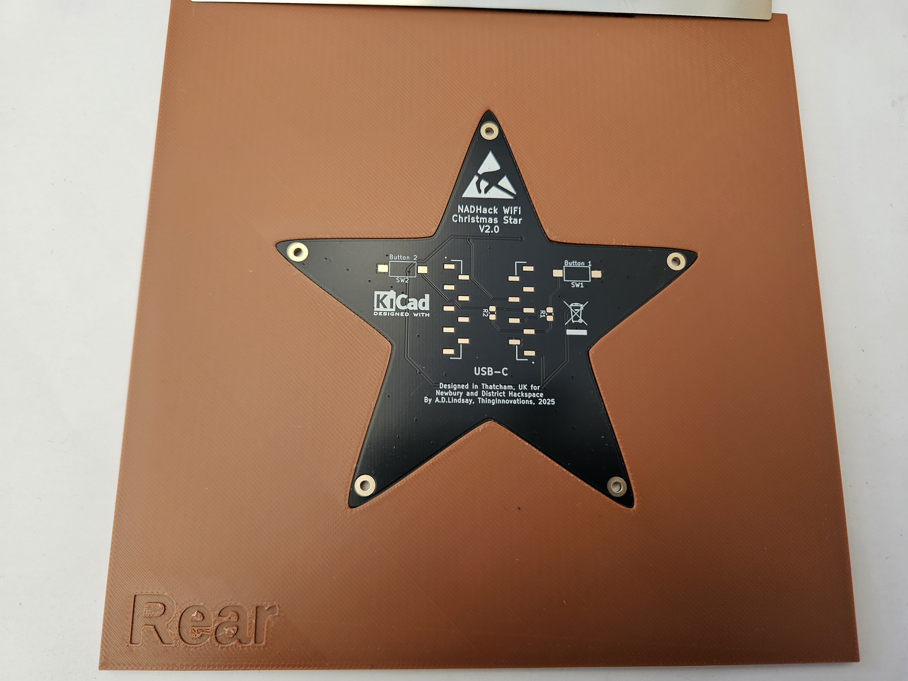
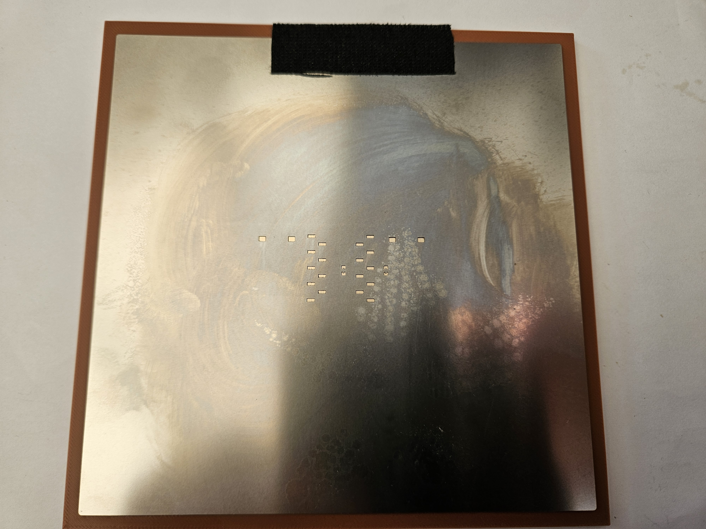

# Rear Solderpaste

The PCB is placed into the rear holder, the stencil is placed over the top and a scraper is used to spread the paste across the holes using a single smooth motion.

Apply stencil, ensure the pads are visible through the stencil holes. Apply the paste smoothly, ensuring the holes are filled.

Carefully lift up the stencil and remove the PCB.

The board should look like this

The stencil can be cleaned using IPA and a paper towel ready for the next person to use. Remember to clean both sides.
