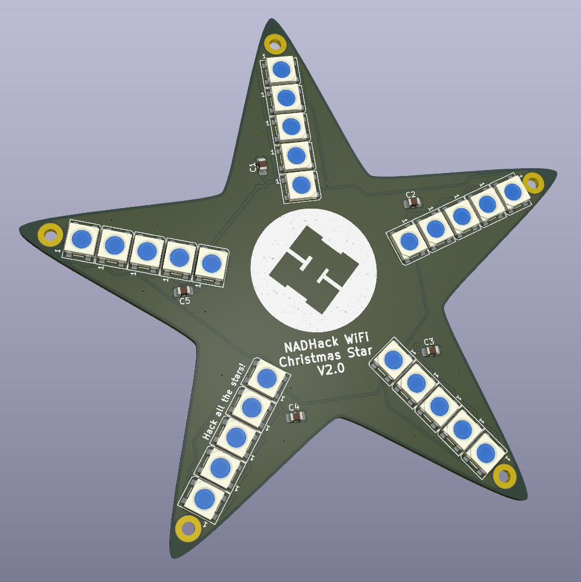

Hardware files for the NADHack Xmas Star V2.0.

* ESP32_Xmas_Star_Module - [KiCad](https://www.kicad.org/) design files.
* Jigs - Source and 3D print files for holding star PCB while applying solderpaste.

