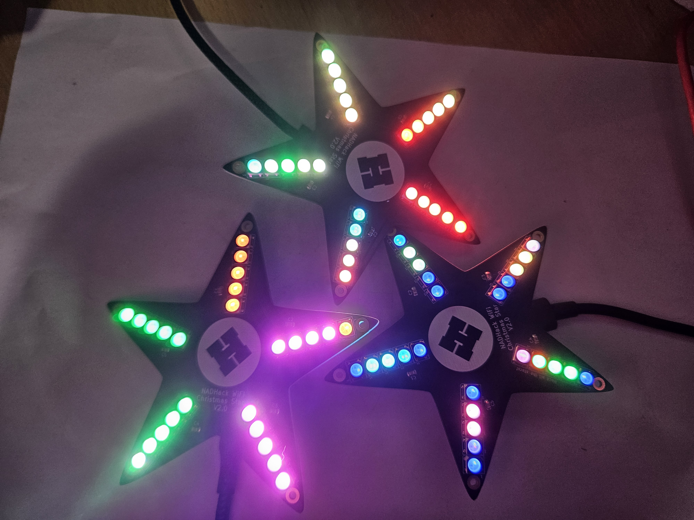

Design files and documentation for the NADHack Xmas Star V2.0 as used in 
the SMD soldering workshop 2025.

* Addons - Addon files, source  and reference designs to enhance your stars.
* Docs - Assembly documentation greated using [MkDocs](https://www.mkdocs.org/)
* Hardware - [KiCad](https://www.kicad.org/) design files.

